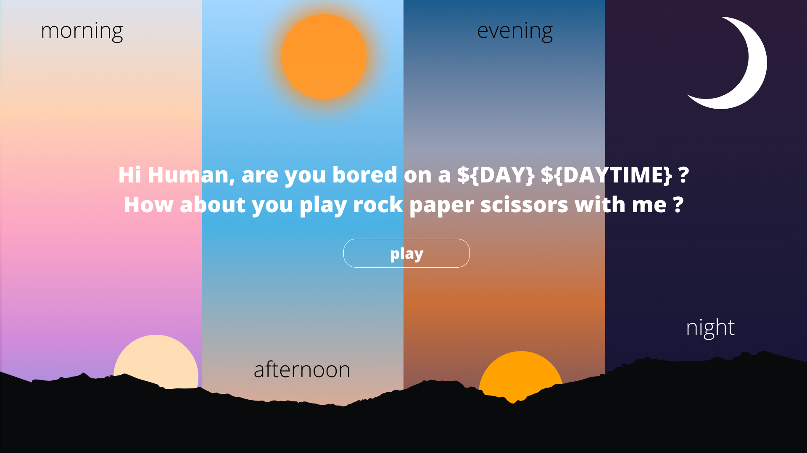

# Project: Rock Paper Scissors

this is my creative implementation of the Rock Paper Scissors game for the Odin Project.

## Features

-   the background changes according to the time of the day.
-   the main heading changes the day according to the current day. ex on a friday morning it becomes :
    Hi Human, are bored on a Friday Morning ?

## What I've learned

-   a lot about css transitions, animations and positioning
-   how to use javascript for updating stuff on the page dynamically
-   importing svg or pngs
-   and a lot of other cool stuff

## TODOS

-   [ ] Make it responsive.
-   [ ] Add a input for the player name so that it shows his name in the score instead of user.
-   [ ] Add a feature where you can choose how many rounds you want to play.
-   [ ] Display the computer choice instead of just displaying if you win a round or not.
